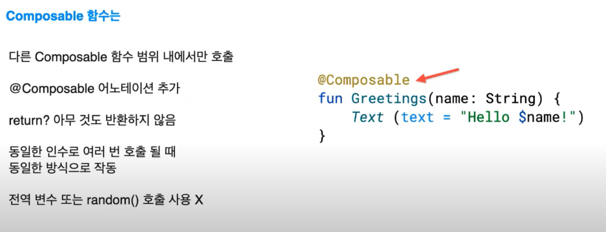

# 구글 I/O 리뷰_V1

### Compose 시작하기 
  - Compose는 2021년 7월에 출시를 앞두고 있다. 이를 통해 안드로이드는 큰 변화를 가져오게 된다고 한다. Jetpack compose는 네이티브 안드로이드 UI를 구현하기 위해 필요한 최신 키트이다.     
  - 이의 장점으로는 __코드 감소__ 로  인한 간단하며 쉬운 유지 관리, 앱 상태가 변경되면 자동으로 업데이트되는 __직관적인__  UI, 언제 어디서든지 사용 가능한 __빠른 개발 과정__ 등이 있습니다. 

__가장 중요한건 layout이 사라진다는 것이다.__   

-----------

## 레이아웃이 왜 사라져?
- __UI toolkit__ 에 새로운 기능을 제공할 때 마다 기본 API버전을 올려야 하기 떄문에 완전히 제공 되려면 오랜 시간이 필요하다.  

  
- 그래서 Compose는 Jetpack 라이브러리로 제공되는 이유는 여기에 있다. 모든 안드로이드 버전과 기기에 일관적으로 작동되게 코드를 작성하는 일관적 라이브러리를 옮긴다면 __UI toolkit__ 에 대한 수정사항도 바로 적용 가능하다.   

#
## 몇가지 특징

  
- 다른 Composable 함수 범위 내에서만 호출이 가능하다. 함수를 Composable 로 만들고 싶다면 Composable 어노테이션을 추가하면 된다. 모든 Composable 함수는 어노테이션이 있어야 작동이 가능하다. 