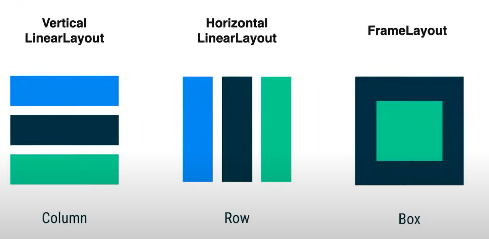

# 구글 I/O 리뷰_V3

### Compose Project 시작하기<br>
- Compose UI를 즉시 미리 볼 수 있는 기능 및 새 프로젝트 템플릿과 같은 스마트 편집기 기능을 사용합니다. 초기 설정 방법은 밑의 사이트를 참고하시면 좋을 것 같습니다.

#
> ## Compose Project 관련 자료
[Android Developers : compose](https://developer.android.com/jetpack/compose/setup)
#
<br><br><br>


레이아웃은 이와 같이 다룰 수 있다.
- 세로로 배치하고 싶으면 __Column__ 
- 가로로 배치하고 싶으면 __Row__
- 겹치는 형태의 Framelayout은 __Box__ <br><br>

### Compose 사용하기 <br><br>
이를 사용한다면 다음과 같이 사용이 가능하다.

``` kotlin
@Composable
fun ArtistCard(artist : Artist) {
    Row(verticalAlignment = Alignment.CenterVertically) {
        Image(/*..*/)
        Column{
            Text(artist.name)
            Text(artist.lastSeenOnline)
        }
    }
}
```

## 결과
<br><br>
이런 형식으로 Row와 Column을 사용할 수 있다.
